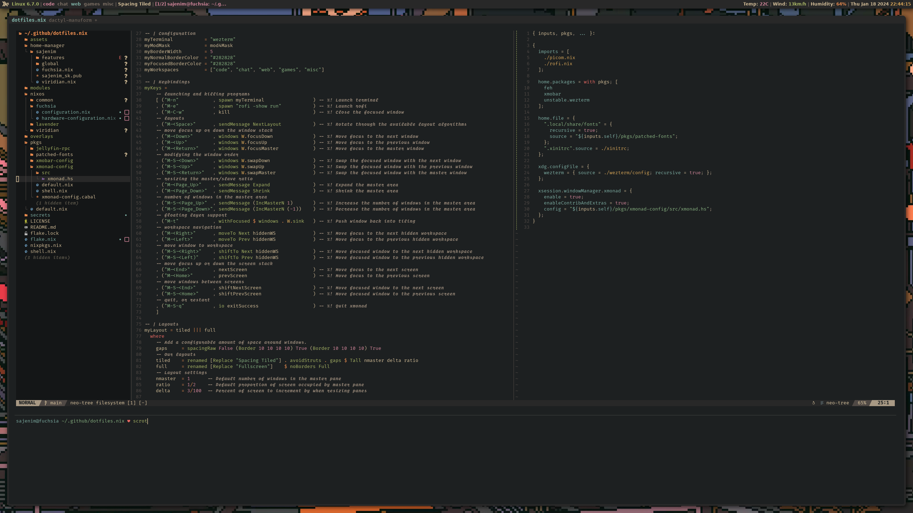

# NixOS & Home-Manager Configuration

My [NixOS](https://nixos.org/) and [Home-Manager](https://github.com/nix-community/home-manager) config files.
Based upon [Misterio77's starter configs](https://github.com/Misterio77/nix-starter-configs).

> This repo is often neglected and doesn't necesarrily follow best practices.  
> I recommend only using this repo for inspiration and instead use this
> [boilerplate](https://github.com/Misterio77/nix-starter-configs/tree/main/standard)

## Preview


## Features
* __Opt-in persistance with ephermeral btrfs.__
* __Secrets managed with agenix and rekeyed with yubikey.__
* __Standalone nixvim configuration for neovim.__
* __Custom haskell packages for xmonad & xmobar.__
* __Declarative minecraft server with nix-minecraft.__
* __Borgbackup of mutable service/container data.__
* __Media server with typical *arr stack.__
* __FQDN with private DNS for all internal services.__
* __Crowdsecurity for all public services.__

## Installation
```sh
# Prepare disks, create an EFI System partition and Linux Filesystem partition
fdisk /dev/nvme0n1

# Create our filesystems
mkfs.fat -F32 -n ESP /dev/nvme0n1p1
mkfs.btrfs -L ${hostname} /dev/nvme0n1p2
    
# Create our subvolumes
mount /dev/nvme0n1p2 /mnt/btrfs
btrfs subvolume create /mnt/btrfs/{root,nix,persist,swap}
umount /mnt/btrfs

# Prepare for installation
mount -o compress=zstd,subvol={root,nix,persist,swap} /dev/nvme0n1p2 /mnt/{nix,persist,swap}
mount /dev/nvme0n1p1 /mnt/boot

# Clone the configuration files and enter repo
git clone https://github.com/sajenim/dotfiles.nix.git && cd dotfiles.nix

# Install our system configuration
nixos-install --flake .#hostname
```

## FAQ
* **What is nix?**  
Nix is a tool that takes a unique approach to package management and system configuration.
* **Nix benefits**  
Nix is reproducible, declarative and reliable.
* **Why flakes?**  
Flakes allow you to specify your code's dependencies (e.g. remote Git repositories) in a declarative way,
simply by listing them inside a flake.nix file.

## Credit
### Boilerplate
* [Misterio77/nix-starter-configs](https://github.com/Misterio77/nix-starter-configs)
### Other Configs
* [fortuneteller2k/nix-config](https://github.com/fortuneteller2k/nix-config)
* [javacafe01/nix-config](https://github.com/javacafe01/nix-config)
